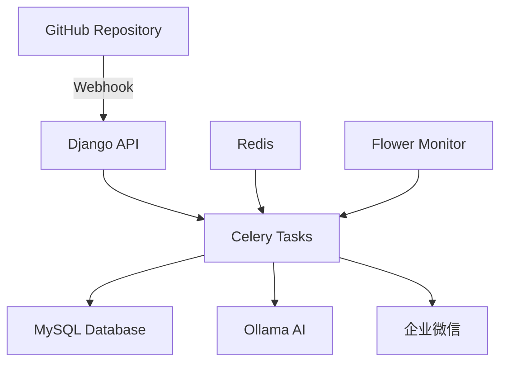
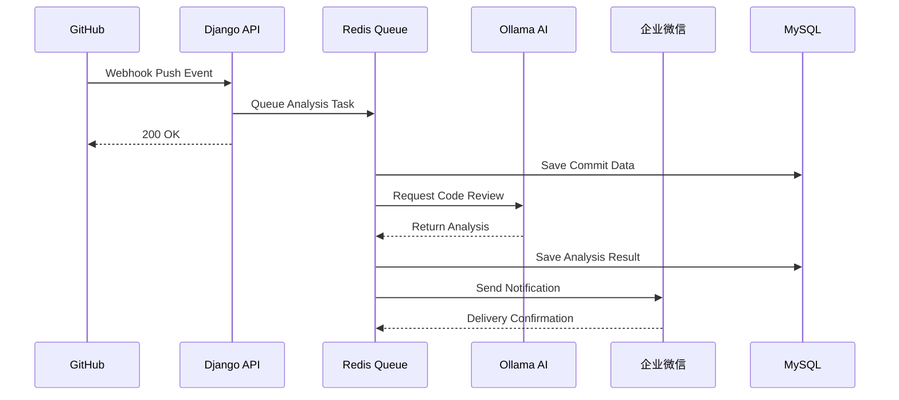

# �� Code Review System

<div align="center">

[](https://python.org)
[](https://djangoproject.com)
[](https://docker.com)
[](LICENSE)

**智能代码审查系统 - 让 AI 为你的代码把关**

[快速开始](#-快速开始) • [功能特性](#-功能特性) • [API 文档](#-api-接口) • [故障排除](#-故障排除)

</div>

---

## 🎯 项目简介

Code Review System 是一个现代化的智能代码审查平台，通过 GitHub Webhook 自动接收代码推送事件，使用 Ollama AI 进行智能代码分析，并将审查结果推送到企业微信群。系统采用异步架构，支持高并发处理，完全容器化部署。

## ✨ 功能特性

| 功能模块 | 描述 | 状态 |
|---------|------|------|
| 🔗 **GitHub 集成** | 自动接收 Webhook 推送事件，实时获取代码变更 | ✅ |
| 🤖 **AI 代码审查** | 基于 Ollama 的智能代码分析和建议生成 | ✅ |
| 💬 **企业微信推送** | 自动推送审查结果到企业微信群聊 | ✅ |
| ⚡ **异步任务队列** | Celery + Redis 异步处理，提升系统性能 | ✅ |
| 📊 **数据持久化** | MySQL 存储提交记录和分析结果 | ✅ |
| 🐳 **容器化部署** | Docker Compose 一键部署，开箱即用 | ✅ |
| 🔍 **监控面板** | Flower 任务监控 + Open WebUI AI 管理 | ✅ |

## 🏗️ 技术架构



**核心技术栈：**
- **后端框架**: Django 5.2+ (Python 3.11+)
- **数据库**: MySQL 8.0 + Redis 7.0
- **AI 引擎**: Ollama (支持 Llama 3.1、CodeLlama 等)
- **异步队列**: Celery + Redis
- **容器化**: Docker + Docker Compose
- **监控工具**: Flower + Open WebUI

**部署模式支持：**
- 🎯 **GPU 加速**: Linux + NVIDIA GPU + Container Toolkit
- 🖥️ **CPU 兼容**: Mac/Windows/无GPU Linux 系统
- 🚀 **智能检测**: 自动选择最佳运行模式

## 🚀 快速开始

### 方式一：Docker 部署（推荐）

**前置要求**
- Docker 20.10+
- Docker Compose 2.0+
- 至少 4GB 可用内存
- 至少 10GB 可用磁盘空间

**1. 克隆项目**
```bash
git clone https://github.com/liuzijun12/code_review.git
cd code_review
```

**2. 配置环境变量**
```bash
# 复制环境配置文件
cp example.env .env

# 编辑配置（必须设置以下项目）
vim .env
```

**⚠️ 必须配置的环境变量：**
```bash
# GitHub 配置（必须）
GITHUB_TOKEN=your_github_personal_access_token
GITHUB_WEBHOOK_SECRET=your_webhook_secret
REPO_OWNER=your_github_username
REPO_NAME=your_repository_name

# 企业微信（必须）
WX_WEBHOOK_URL=your_wechat_webhook_url
```

**3. 选择部署模式**

系统提供了三种启动方式：

| 启动方式 | 配置文件 | 适用场景 | 性能 |
|---------|----------|----------|------|
| 🚀 **智能启动** | `./start.sh` | 自动检测环境 | 最优 |
| 🎯 **GPU 模式** | `docker-compose.yml` | Linux + NVIDIA GPU | 高性能 |
| 🖥️ **CPU 模式** | `docker-compose.cpu.yml` | Mac/Windows/无GPU | 兼容性好 |

**方式 A: 智能启动（推荐）**
```bash
# 一键启动，自动检测并选择最佳配置
./start.sh

# 或者手动指定模式
./start.sh gpu    # 强制 GPU 模式
./start.sh cpu    # 强制 CPU 模式
./start.sh help   # 查看帮助
```

**方式 B: 手动选择模式**
```bash
# GPU 模式（Linux + NVIDIA GPU）
docker-compose up --build -d

# CPU 模式（Mac/Windows/无GPU）
docker-compose -f docker-compose.cpu.yml up --build -d
```

**4. 初始化 AI 模型**
```bash
# 等待 Ollama 服务完全启动后（约30秒）
sleep 30

# 下载 Llama 模型（首次使用，需要几分钟）
docker exec -it code_review_ollama ollama pull llama3.1:8b

# 验证模型安装
docker exec -it code_review_ollama ollama list
```

**5. 验证服务状态**
```bash
# 检查所有服务状态
docker-compose ps

# 检查主应用健康状态
curl http://localhost:8000/ai/health/

# 检查 Ollama API
curl http://localhost:11434/api/tags
```

**6. 访问服务**
- 🌐 **主应用**: http://localhost:8000
- 📊 **任务监控**: http://localhost:5555 (Flower)
- 🤖 **AI 管理**: http://localhost:3000 (Open WebUI)

### 方式二：本地开发

<details>
<summary>点击展开本地开发指南</summary>

**环境要求**
- Python 3.11+
- MySQL 8.0+
- Redis 6.0+
- Git

**安装步骤**
```bash
# 1. 创建虚拟环境
python -m venv venv
source venv/bin/activate  # Linux/Mac
# venv\Scripts\activate   # Windows

# 2. 安装依赖
pip install -r requirement.txt

# 3. 配置数据库
mysql -u root -p
CREATE DATABASE code_review CHARACTER SET utf8mb4;

# 4. 运行迁移
python manage.py migrate
python manage.py createsuperuser

# 5. 启动服务（需要多个终端）
# 终端1: Django
python manage.py runserver

# 终端2: Celery Worker
celery -A code_review worker --loglevel=info

# 终端3: Redis
redis-server

# 终端4: Ollama
ollama serve
```

</details>

## 🎯 部署模式详解

### GPU vs CPU 模式对比

| 特性 | GPU 模式 | CPU 模式 |
|------|----------|----------|
| **配置文件** | `docker-compose.yml` | `docker-compose.cpu.yml` |
| **适用系统** | Linux + NVIDIA GPU | Mac/Windows/无GPU Linux |
| **AI 推理速度** | 🚀 极快 (GPU 加速) | 🐌 较慢 (CPU 计算) |
| **内存占用** | 较低 (GPU 显存) | 较高 (系统内存) |
| **部署复杂度** | 中等 (需要 GPU 支持) | 简单 (开箱即用) |
| **硬件要求** | NVIDIA GPU + 驱动 | 任何 x86_64 系统 |

### 选择建议

**选择 GPU 模式的情况：**
- ✅ 使用 Linux 系统
- ✅ 有 NVIDIA GPU (GTX 1060+ 或 RTX 系列)
- ✅ 已安装 NVIDIA Container Toolkit
- ✅ 需要高性能 AI 推理

**选择 CPU 模式的情况：**
- ✅ 使用 Mac 或 Windows 系统
- ✅ 没有 NVIDIA GPU
- ✅ 只是测试或轻量使用
- ✅ 不想配置 GPU 环境

### 环境检测

使用以下命令检测您的环境：

```bash
# 检测 GPU 支持
nvidia-smi                    # 检查 NVIDIA GPU
docker info | grep nvidia    # 检查 Docker GPU 支持

# 检测系统信息
uname -s                      # 操作系统类型
docker --version              # Docker 版本
docker-compose --version      # Docker Compose 版本
```

## 🔧 配置说明

### 环境变量配置 (.env)

**Docker 部署配置示例**:
```bash
# ==================== Django 基础配置 ====================
DEBUG=True
SECRET_KEY=your-super-secret-key-change-in-production
ALLOWED_HOSTS=localhost,127.0.0.1,0.0.0.0

# ==================== 数据库配置 ====================
# Docker 环境使用容器名作为主机名
DB_ENGINE=django.db.backends.mysql
DB_NAME=code_review
DB_USER=root
DB_PASSWORD=123456
DB_HOST=mysql          # Docker 容器名
DB_PORT=3306

# ==================== Redis 配置 ====================
# Docker 环境使用容器名作为主机名
CELERY_BROKER_URL=redis://redis:6379/0
CELERY_RESULT_BACKEND=redis://redis:6379/0

# ==================== Ollama AI 配置 ====================
# Docker 环境使用容器名作为主机名
OLLAMA_BASE_URL=http://ollama:11434
OLLAMA_DEFAULT_CHAT_MODEL=llama3.1:8b
OLLAMA_CODE_REVIEW_MODEL=llama3.1:8b
OLLAMA_COMMIT_ANALYSIS_MODEL=llama3.1:8b
OLLAMA_CONNECTION_TIMEOUT=10
OLLAMA_REQUEST_TIMEOUT=600
OLLAMA_MAX_RETRIES=2

# ==================== GitHub 配置 (必须设置) ====================
GITHUB_TOKEN=your_github_personal_access_token
GITHUB_WEBHOOK_SECRET=your_webhook_secret_here
REPO_OWNER=your_github_username
REPO_NAME=your_repository_name

# GitHub API 限制
GITHUB_DAILY_LIMIT=1000
GITHUB_HOURLY_LIMIT=40
GITHUB_TIMEOUT=30
GITHUB_MAX_RETRIES=3

# ==================== 企业微信推送配置 (必须设置) ====================
WX_WEBHOOK_URL=https://qyapi.weixin.qq.com/cgi-bin/webhook/send?key=YOUR_KEY

# ==================== 调试配置 ====================
LOG_LEVEL=INFO
OLLAMA_DEBUG=false
GITHUB_DEBUG=false
```

**本地开发配置示例**:
```bash
# 本地开发时使用 localhost
DB_HOST=localhost
OLLAMA_BASE_URL=http://localhost:11434
CELERY_BROKER_URL=redis://localhost:6379/0
CELERY_RESULT_BACKEND=redis://localhost:6379/0
```

### GitHub Webhook 配置

1. 进入你的 GitHub 仓库设置
2. 选择 "Webhooks" → "Add webhook"
3. 配置如下：
   - **Payload URL**: `http://your-domain.com:8000/ai/git-webhook/`
   - **Content type**: `application/json`
   - **Events**: 选择 "Push events"

## 📡 API 接口

### 核心接口

| 端点 | 方法 | 描述 | 示例 |
|------|------|------|------|
| `/ai/git-webhook/` | POST | GitHub Webhook 接收 | 自动触发 |
| `/ai/github-data/` | GET | 查询提交数据 | `?type=recent_commits&limit=10` |
| `/ai/github-data-async/` | POST | 异步数据处理 | 返回 task_id |
| `/ai/task-status/{task_id}/` | GET | 查询任务状态 | 任务进度跟踪 |
| `/ai/health/` | GET | 系统健康检查 | 服务状态监控 |

### 使用示例

```bash
# 获取最近提交记录
curl "http://localhost:8000/ai/github-data/?type=recent_commits&branch=main&limit=5"

# 获取特定提交详情
curl "http://localhost:8000/ai/github-data/?type=commit_details&sha=abc123&include_diff=true"

# 检查系统状态
curl "http://localhost:8000/ai/health/"
```

## 🔍 监控与管理

### 服务监控

```bash
# 查看所有容器状态（根据使用的配置文件）
docker-compose ps                                    # GPU 模式
docker-compose -f docker-compose.cpu.yml ps        # CPU 模式

# 查看特定服务日志
docker-compose logs -f django                      # GPU 模式
docker-compose -f docker-compose.cpu.yml logs -f django  # CPU 模式

# 重启服务
docker-compose restart django                      # GPU 模式
docker-compose -f docker-compose.cpu.yml restart django  # CPU 模式

# 进入容器调试
docker exec -it code_review_django bash

# 使用智能启动脚本的用户可以查看启动日志获取使用的配置文件
./start.sh | grep "使用配置文件"
```

### 系统状态检查

**快速诊断脚本**
```bash
#!/bin/bash
# 保存为 check_system.sh 并执行 chmod +x check_system.sh

echo "🔍 Code Review System 状态检查"
echo "================================"

# 检查 Docker 服务状态
echo "📋 Docker 容器状态:"
docker-compose ps

echo -e "\n🌐 服务连通性检查:"
# 检查主应用
curl -s http://localhost:8000/ai/health/ > /dev/null && echo "✅ Django 主应用: 正常" || echo "❌ Django 主应用: 异常"

# 检查 Ollama
curl -s http://localhost:11434/api/tags > /dev/null && echo "✅ Ollama AI: 正常" || echo "❌ Ollama AI: 异常"

# 检查 Redis
docker exec -it code_review_redis redis-cli ping > /dev/null 2>&1 && echo "✅ Redis: 正常" || echo "❌ Redis: 异常"

# 检查 MySQL
docker exec -it code_review_mysql mysqladmin ping -h localhost -u root -p123456 > /dev/null 2>&1 && echo "✅ MySQL: 正常" || echo "❌ MySQL: 异常"

echo -e "\n📊 资源使用情况:"
docker stats --no-stream --format "table {{.Name}}\t{{.CPUPerc}}\t{{.MemUsage}}"

echo -e "\n📝 最近日志 (最后10行):"
echo "--- Django ---"
docker-compose logs --tail=10 django
echo -e "\n--- Ollama ---"
docker-compose logs --tail=10 ollama
```

**详细系统检查**
```bash
# 检查系统状态（容器内）
docker exec -it code_review_django python manage.py system_status --verbose

# 检查 Celery 任务队列
docker exec -it code_review_django celery -A code_review inspect active

# 检查已安装的 AI 模型
docker exec -it code_review_ollama ollama list
```

## 🛠️ 故障排除

### 常见问题

<details>
<summary><strong>🔴 Docker 构建网络超时</strong></summary>

**问题描述**: 构建时出现 `DeadlineExceeded: failed to fetch oauth token`

**解决方案**:
```bash
# 方案 1: 手动拉取基础镜像
docker pull python:3.11-slim
docker pull mysql:8.0
docker pull redis:7-alpine
docker pull ollama/ollama:latest

# 方案 2: 配置 Docker 镜像源（国内用户）
mkdir -p ~/.docker
cat > ~/.docker/daemon.json << EOF
{
  "registry-mirrors": [
    "https://docker.m.daocloud.io",
    "https://dockerproxy.com",
    "https://mirror.baidubce.com"
  ]
}
EOF

# 重启 Docker 服务
sudo systemctl restart docker  # Linux
# 或重启 Docker Desktop    # Mac/Windows
```

</details>

<details>
<summary><strong>🔴 GPU 配置错误</strong></summary>

**问题描述**: `could not select device driver "nvidia" with capabilities: [[gpu]]`

**解决方案**: 系统没有 NVIDIA GPU 或未安装 NVIDIA Container Toolkit
```bash
# 方案 1: 使用 CPU 模式（推荐）
docker-compose -f docker-compose.cpu.yml up --build -d

# 或使用智能启动脚本强制 CPU 模式
./start.sh cpu

# 方案 2: 如果有 GPU，安装 NVIDIA Container Toolkit
# Ubuntu/Debian:
curl -fsSL https://nvidia.github.io/libnvidia-container/gpgkey | sudo gpg --dearmor -o /usr/share/keyrings/nvidia-container-toolkit-keyring.gpg
curl -s -L https://nvidia.github.io/libnvidia-container/stable/deb/nvidia-container-toolkit.list | \
  sed 's#deb https://#deb [signed-by=/usr/share/keyrings/nvidia-container-toolkit-keyring.gpg] https://#g' | \
  sudo tee /etc/apt/sources.list.d/nvidia-container-toolkit.list
sudo apt-get update && sudo apt-get install -y nvidia-container-toolkit
sudo systemctl restart docker
```

</details>

<details>
<summary><strong>🔴 .env 文件缺失</strong></summary>

**问题描述**: 启动时提示找不到 `.env` 文件

**解决方案**:
```bash
# 创建 .env 文件
cp example.env .env

# 或手动创建最小配置
cat > .env << EOF
DEBUG=True
SECRET_KEY=your-secret-key-change-in-production
ALLOWED_HOSTS=localhost,127.0.0.1,0.0.0.0

# 数据库配置（Docker 环境）
DB_ENGINE=django.db.backends.mysql
DB_NAME=code_review
DB_USER=root
DB_PASSWORD=123456
DB_HOST=mysql
DB_PORT=3306

# GitHub 配置（需要真实值）
GITHUB_TOKEN=your_github_token
GITHUB_WEBHOOK_SECRET=your_webhook_secret
REPO_OWNER=your_username
REPO_NAME=your_repo

# AI 配置
OLLAMA_BASE_URL=http://ollama:11434
OLLAMA_DEFAULT_CHAT_MODEL=llama3.1:8b

# 企业微信
WX_WEBHOOK_URL=your_wechat_webhook_url

# Redis
CELERY_BROKER_URL=redis://redis:6379/0
CELERY_RESULT_BACKEND=redis://redis:6379/0
EOF
```

</details>

<details>
<summary><strong>🔴 Celery 任务不执行</strong></summary>

```bash
# 检查 Redis 连接
docker exec -it code_review_redis redis-cli ping

# 重启 Celery Worker
docker-compose restart celery_worker

# 查看 Celery 日志
docker-compose logs -f celery_worker
```

</details>

<details>
<summary><strong>🔴 AI 分析失败</strong></summary>

```bash
# 检查 Ollama 服务状态
curl http://localhost:11434/api/tags

# 重新拉取模型
docker exec -it code_review_ollama ollama pull llama3.1:8b

# 查看 Ollama 日志
docker-compose logs -f ollama
```

</details>

<details>
<summary><strong>🔴 数据库连接问题</strong></summary>

```bash
# 检查 MySQL 服务
docker-compose logs -f mysql

# 重置数据库
docker-compose down
docker volume rm code_review_mysql_data
docker-compose up -d mysql

# 重新运行迁移
docker exec -it code_review_django python manage.py migrate
```

</details>

<details>
<summary><strong>🔴 端口冲突</strong></summary>

修改 `docker-compose.yml` 中的端口映射：
```yaml
ports:
  - "8001:8000"  # 将 8000 改为其他端口
```

</details>

### 日志位置

- **应用日志**: `./logs/` 目录
- **Docker 日志**: `docker-compose logs [service_name]`
- **系统日志**: 容器内 `/var/log/` 目录

## 📁 项目结构

```
code_review/
├── 🐳 docker-compose.yml      # Docker 服务编排 (GPU 模式)
├── 🐳 docker-compose.cpu.yml  # Docker 服务编排 (CPU 模式)
├── 🚀 start.sh                # 智能启动脚本
├── 🐳 Dockerfile              # Django 应用镜像
├── 📋 requirement.txt         # Python 依赖
├── 🔧 example.env             # 环境变量模板
├── 
├── code_review/               # Django 项目配置
│   ├── ⚙️  settings.py        # 项目设置
│   ├── 🔄 celery.py           # Celery 配置
│   └── 🌐 urls.py             # URL 路由
├── 
├── app_ai/                    # AI 功能核心模块
│   ├── 📊 models.py           # 数据模型
│   ├── 🌐 views.py            # API 视图
│   ├── 🔗 git_client.py       # GitHub API 客户端
│   ├── 🤖 ollama_client.py    # Ollama AI 客户端
│   ├── 💬 info_push.py        # 企业微信推送
│   ├── 
│   ├── tasks/                 # 异步任务模块
│   │   ├── 📥 async_get.py    # 异步数据获取
│   │   └── 📤 async_push.py   # 异步消息推送
│   ├── 
│   └── management/commands/
│       └── 🔍 system_status.py # 系统诊断工具
└── 
└── logs/                      # 应用日志目录
```

## 🚀 工作流程



**详细步骤：**
1. **代码推送** → GitHub 触发 Webhook → Django 接收事件
2. **任务入队** → Celery 异步处理 → 数据存储到 MySQL
3. **AI 分析** → Ollama 代码审查 → 生成改进建议
4. **结果推送** → 企业微信通知 → 团队实时接收反馈

## 🤝 贡献指南

1. Fork 本仓库
2. 创建特性分支 (`git checkout -b feature/AmazingFeature`)
3. 提交更改 (`git commit -m 'Add some AmazingFeature'`)
4. 推送到分支 (`git push origin feature/AmazingFeature`)
5. 创建 Pull Request

## 📄 许可证

本项目采用 MIT 许可证 - 查看 [LICENSE](LICENSE) 文件了解详情。

## 📞 支持与反馈

- 🐛 **问题报告**: [GitHub Issues](https://github.com/liuzijun12/code_review/issues)
- 💡 **功能建议**: [GitHub Discussions](https://github.com/liuzijun12/code_review/discussions)
- 📧 **联系作者**: [liuzijun12@example.com](mailto:liuzijun12@example.com)

---

<div align="center">

**⭐ 如果这个项目对你有帮助，请给个 Star！**

Made with ❤️ by [liuzijun12](https://github.com/liuzijun12)

</div>
