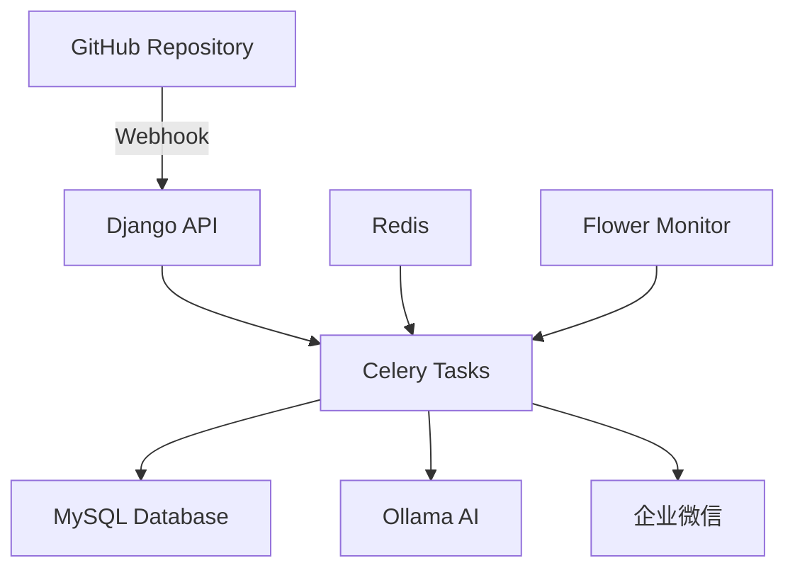
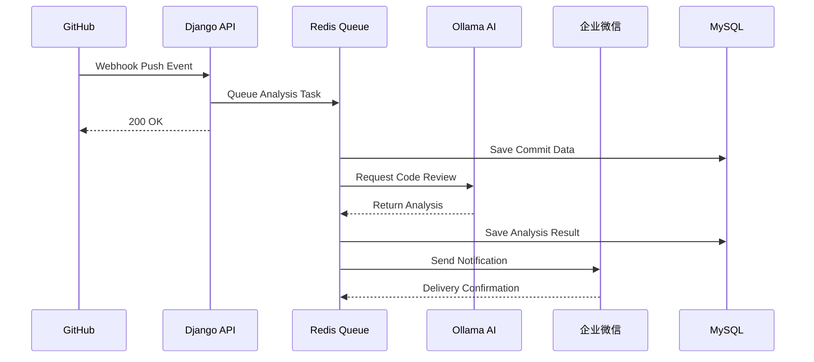

# �� Code Review System

<div align="center">

[](https://python.org)
[](https://djangoproject.com)
[](https://docker.com)
[](LICENSE)

**智能代码审查系统 - 让 AI 为你的代码把关**

[快速开始](#-快速开始) • [功能特性](#-功能特性) • [API 文档](#-api-接口) • [故障排除](#-故障排除)

</div>

---

## 🎯 项目简介

Code Review System 是一个现代化的智能代码审查平台，通过 GitHub Webhook 自动接收代码推送事件，使用 Ollama AI 进行智能代码分析，并将审查结果推送到企业微信群。系统采用异步架构，支持高并发处理，完全容器化部署。

## ✨ 功能特性

| 功能模块 | 描述 | 状态 |
|---------|------|------|
| 🔗 **GitHub 集成** | 自动接收 Webhook 推送事件，实时获取代码变更 | ✅ |
| 🤖 **AI 代码审查** | 基于 Ollama 的智能代码分析和建议生成 | ✅ |
| 💬 **企业微信推送** | 自动推送审查结果到企业微信群聊 | ✅ |
| ⚡ **异步任务队列** | Celery + Redis 异步处理，提升系统性能 | ✅ |
| 📊 **数据持久化** | MySQL 存储提交记录和分析结果 | ✅ |
| 🐳 **容器化部署** | Docker Compose 一键部署，开箱即用 | ✅ |
| 🔍 **监控面板** | Flower 任务监控 + Open WebUI AI 管理 | ✅ |

## 🏗️ 技术架构



**核心技术栈：**
- **后端框架**: Django 5.2+ (Python 3.11+)
- **数据库**: MySQL 8.0 + Redis 7.0
- **AI 引擎**: Ollama (支持 Llama 3.1、CodeLlama 等)
- **异步队列**: Celery + Redis
- **容器化**: Docker + Docker Compose
- **监控工具**: Flower + Open WebUI

## 🚀 快速开始

### 方式一：Docker 部署（推荐）

**1. 克隆项目**
```bash
git clone https://github.com/liuzijun12/code_review.git
cd code_review
```

**2. 配置环境变量**
```bash
# 复制环境配置文件
cp example.env .env

# 编辑配置（必须）
vim .env
```

**3. 一键启动所有服务**
```bash
# 启动所有服务（包含 GPU 支持）
docker-compose up -d

# 查看服务状态
docker-compose ps

# 查看实时日志
docker-compose logs -f django
```

**4. 初始化 AI 模型**
```bash
# 下载 Llama 模型（首次使用）
docker exec -it code_review_ollama ollama pull llama3.1:8b

# 验证模型安装
docker exec -it code_review_ollama ollama list
```

**5. 访问服务**
- 🌐 **主应用**: http://localhost:8000
- 📊 **任务监控**: http://localhost:5555 (Flower)
- 🤖 **AI 管理**: http://localhost:3000 (Open WebUI)

### 方式二：本地开发

<details>
<summary>点击展开本地开发指南</summary>

**环境要求**
- Python 3.11+
- MySQL 8.0+
- Redis 6.0+
- Git

**安装步骤**
```bash
# 1. 创建虚拟环境
python -m venv venv
source venv/bin/activate  # Linux/Mac
# venv\Scripts\activate   # Windows

# 2. 安装依赖
pip install -r requirement.txt

# 3. 配置数据库
mysql -u root -p
CREATE DATABASE code_review CHARACTER SET utf8mb4;

# 4. 运行迁移
python manage.py migrate
python manage.py createsuperuser

# 5. 启动服务（需要多个终端）
# 终端1: Django
python manage.py runserver

# 终端2: Celery Worker
celery -A code_review worker --loglevel=info

# 终端3: Redis
redis-server

# 终端4: Ollama
ollama serve
```

</details>

## 🔧 配置说明

### 环境变量配置 (.env)

```bash
# Django 基础配置
DEBUG=True
SECRET_KEY=your-super-secret-key-here
ALLOWED_HOSTS=localhost,127.0.0.1,0.0.0.0

# 数据库配置
DB_NAME=code_review
DB_USER=root
DB_PASSWORD=123456
DB_HOST=localhost  # Docker 中会自动替换为 mysql
DB_PORT=3306

# Redis 配置
CELERY_BROKER_URL=redis://localhost:6379/0
CELERY_RESULT_BACKEND=redis://localhost:6379/0

# Ollama AI 配置
OLLAMA_BASE_URL=http://localhost:11434
OLLAMA_DEFAULT_CHAT_MODEL=llama3.1:8b
OLLAMA_TIMEOUT=300

# 企业微信推送配置
WX_WEBHOOK_URL=https://qyapi.weixin.qq.com/cgi-bin/webhook/send?key=YOUR_KEY

# GitHub 配置（必须）
GITHUB_TOKEN=your_github_token_here
```

### GitHub Webhook 配置

1. 进入你的 GitHub 仓库设置
2. 选择 "Webhooks" → "Add webhook"
3. 配置如下：
   - **Payload URL**: `http://your-domain.com:8000/ai/git-webhook/`
   - **Content type**: `application/json`
   - **Events**: 选择 "Push events"

## 📡 API 接口

### 核心接口

| 端点 | 方法 | 描述 | 示例 |
|------|------|------|------|
| `/ai/git-webhook/` | POST | GitHub Webhook 接收 | 自动触发 |
| `/ai/github-data/` | GET | 查询提交数据 | `?type=recent_commits&limit=10` |
| `/ai/github-data-async/` | POST | 异步数据处理 | 返回 task_id |
| `/ai/task-status/{task_id}/` | GET | 查询任务状态 | 任务进度跟踪 |
| `/ai/health/` | GET | 系统健康检查 | 服务状态监控 |

### 使用示例

```bash
# 获取最近提交记录
curl "http://localhost:8000/ai/github-data/?type=recent_commits&branch=main&limit=5"

# 获取特定提交详情
curl "http://localhost:8000/ai/github-data/?type=commit_details&sha=abc123&include_diff=true"

# 检查系统状态
curl "http://localhost:8000/ai/health/"
```

## 🔍 监控与管理

### 服务监控

```bash
# 查看所有容器状态
docker-compose ps

# 查看特定服务日志
docker-compose logs -f django
docker-compose logs -f celery_worker

# 重启服务
docker-compose restart django

# 进入容器调试
docker exec -it code_review_django bash
```

### 系统状态检查

```bash
# 检查系统状态（容器内）
docker exec -it code_review_django python manage.py system_status --verbose

# 检查 Celery 任务队列
docker exec -it code_review_django celery -A code_review inspect active
```

## 🛠️ 故障排除

### 常见问题

<details>
<summary><strong>🔴 Celery 任务不执行</strong></summary>

```bash
# 检查 Redis 连接
docker exec -it code_review_redis redis-cli ping

# 重启 Celery Worker
docker-compose restart celery_worker

# 查看 Celery 日志
docker-compose logs -f celery_worker
```

</details>

<details>
<summary><strong>🔴 AI 分析失败</strong></summary>

```bash
# 检查 Ollama 服务状态
curl http://localhost:11434/api/tags

# 重新拉取模型
docker exec -it code_review_ollama ollama pull llama3.1:8b

# 查看 Ollama 日志
docker-compose logs -f ollama
```

</details>

<details>
<summary><strong>🔴 数据库连接问题</strong></summary>

```bash
# 检查 MySQL 服务
docker-compose logs -f mysql

# 重置数据库
docker-compose down
docker volume rm code_review_mysql_data
docker-compose up -d mysql

# 重新运行迁移
docker exec -it code_review_django python manage.py migrate
```

</details>

<details>
<summary><strong>🔴 端口冲突</strong></summary>

修改 `docker-compose.yml` 中的端口映射：
```yaml
ports:
  - "8001:8000"  # 将 8000 改为其他端口
```

</details>

### 日志位置

- **应用日志**: `./logs/` 目录
- **Docker 日志**: `docker-compose logs [service_name]`
- **系统日志**: 容器内 `/var/log/` 目录

## 📁 项目结构

```
code_review/
├── 🐳 docker-compose.yml      # Docker 服务编排
├── 🐳 Dockerfile              # Django 应用镜像
├── 📋 requirement.txt         # Python 依赖
├── 🔧 example.env             # 环境变量模板
├── 📚 DEPLOYMENT.md           # 部署文档
├── 
├── code_review/               # Django 项目配置
│   ├── ⚙️  settings.py        # 项目设置
│   ├── 🔄 celery.py           # Celery 配置
│   └── 🌐 urls.py             # URL 路由
├── 
├── app_ai/                    # AI 功能核心模块
│   ├── 📊 models.py           # 数据模型
│   ├── 🌐 views.py            # API 视图
│   ├── 🔗 git_client.py       # GitHub API 客户端
│   ├── 🤖 ollama_client.py    # Ollama AI 客户端
│   ├── 💬 info_push.py        # 企业微信推送
│   ├── 
│   ├── tasks/                 # 异步任务模块
│   │   ├── 📥 async_get.py    # 异步数据获取
│   │   └── 📤 async_push.py   # 异步消息推送
│   ├── 
│   └── management/commands/
│       └── 🔍 system_status.py # 系统诊断工具
└── 
└── logs/                      # 应用日志目录
```

## 🚀 工作流程



**详细步骤：**
1. **代码推送** → GitHub 触发 Webhook → Django 接收事件
2. **任务入队** → Celery 异步处理 → 数据存储到 MySQL
3. **AI 分析** → Ollama 代码审查 → 生成改进建议
4. **结果推送** → 企业微信通知 → 团队实时接收反馈

## 🤝 贡献指南

1. Fork 本仓库
2. 创建特性分支 (`git checkout -b feature/AmazingFeature`)
3. 提交更改 (`git commit -m 'Add some AmazingFeature'`)
4. 推送到分支 (`git push origin feature/AmazingFeature`)
5. 创建 Pull Request

## 📄 许可证

本项目采用 MIT 许可证 - 查看 [LICENSE](LICENSE) 文件了解详情。

## 📞 支持与反馈

- 🐛 **问题报告**: [GitHub Issues](https://github.com/liuzijun12/code_review/issues)
- 💡 **功能建议**: [GitHub Discussions](https://github.com/liuzijun12/code_review/discussions)
- 📧 **联系作者**: [liuzijun12@example.com](mailto:liuzijun12@example.com)

---

<div align="center">

**⭐ 如果这个项目对你有帮助，请给个 Star！**

Made with ❤️ by [liuzijun12](https://github.com/liuzijun12)

</div>
